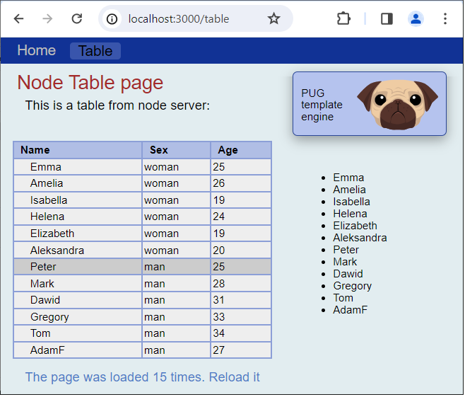

## The Node multipage web-app with Express, TS, Pug engine

The Node multipage web-app with Express, TS, Pug engine displays a table downloaded from the Node server.
      
The menu loads various pages from the server using routing methods.
      
The application used:

- TypeScript language;
- Express framework;
- Built-in middleware: express.static;
- Pug template engine;
- Pug also displays variables from the server;
- Uses helpers: [each], [if];

.

The Table tab generates a table from the Node server to the browser page. 
Press position [Table] in menu

## Launching the application

- Make changes to the [index.ts] file, e.g. change the message;
- Run the command: [npm run build]
- Run the command: [npm run start]
- Launch your browser with [http://localhost:3000/]

You will receive the entry in your browser. The [build] command compiled the file [index.ts] to [index.js] (because the browser does not understand ts files). The [start] command (for production) launched this js file in the browser.
Each time you change [index.ts], you must run these two commands.

## Fast developer testing

The above startup is tedious. For the developer, there is a better way:
- When you don't have it, install [npm and nodemon]
- In the [package.json] file is command: ["dev": "nodemon index.ts",]
- Run the application with the command: [npm run dev]

Now when you change the content of ts files - nodemon compiles them to temporary: js on the fly and exposes the project to the browser. You just need to refresh the browser and the changes will be visible. This route does not modify the js files js.
